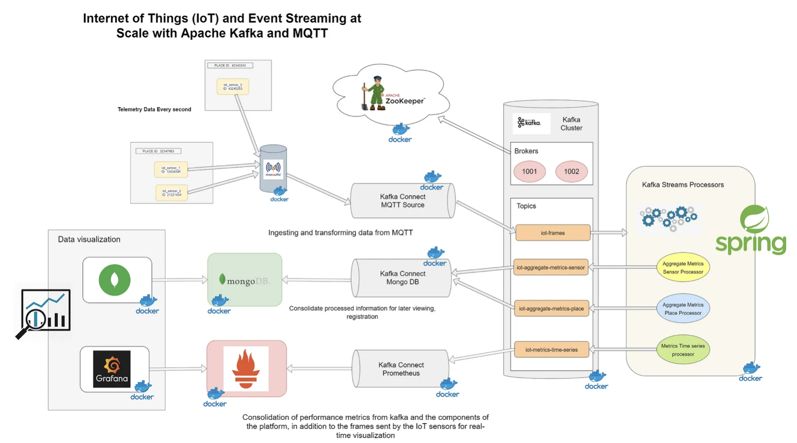

# IOT_Class_Cumcuber

## Repo นี้เป็นส่วนหนึ่งในวิชา IOT 
> บอร์ดที่ใช้: Cucumber RS

> Software ที่ใช้พัฒนา: Arduino
### Library ที่ใช้:
> สำหรับส่งค่าผ่าน MQTT
1. Wire
2. ArduinoJson
3. WiFi
4. PubSubClient

> สำหรับอ่านค่าจาก senser
1. Adafruit_BMP280 : วัดความดันอากาศแบบสัมบูรณ์ (300 ~ 1100 hPa)
2. Adafruit_MPU6050 : ตรวจจับการเคลื่อนไหว (ความเร่งแบบ 3 แกน & ไจโรสโคปแบบ 3 แกน)
3. Adafruit_HTS221 : วัดอุณหภูมิ (-40 ~ 120 °C) และความชื้น (0 ~ 100 %RH)
4. SensirionI2cSht4x

> ตั้งค่าสี LED
1. Adafruit_NeoPixel

> ตั้งค่า time
1. time
2. ESPNtpClient
